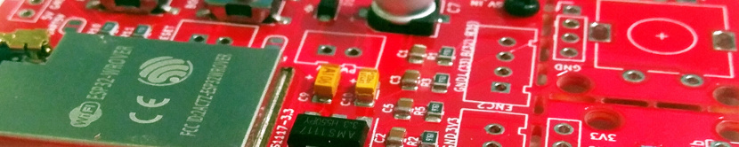
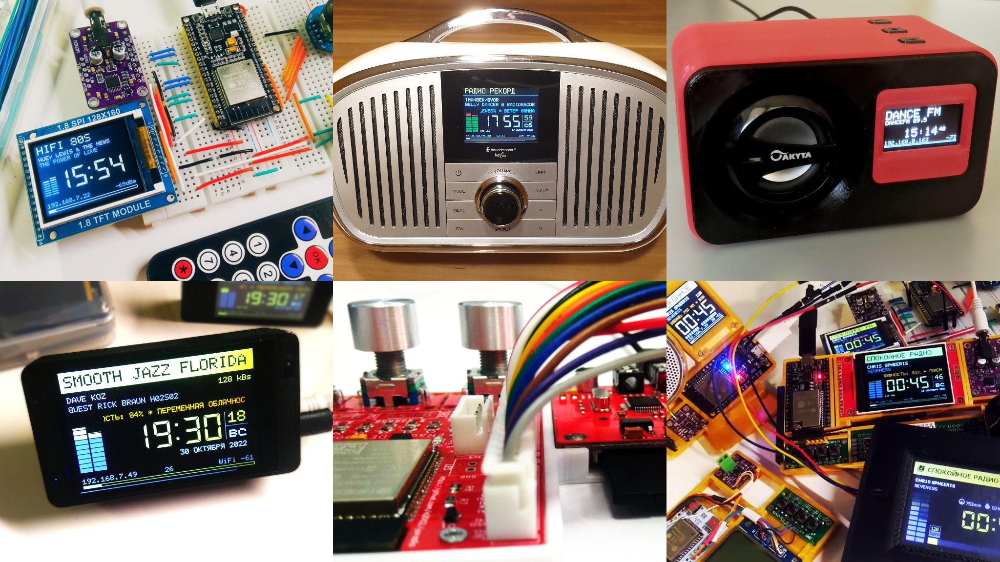
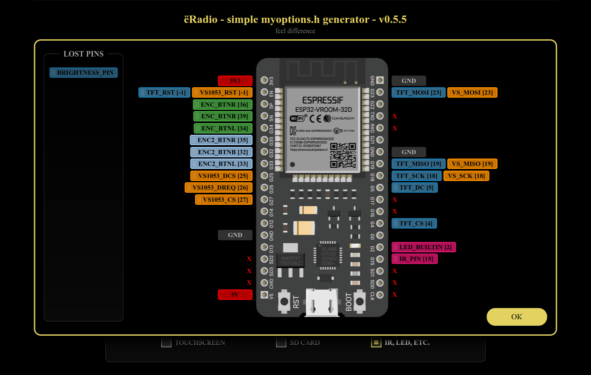
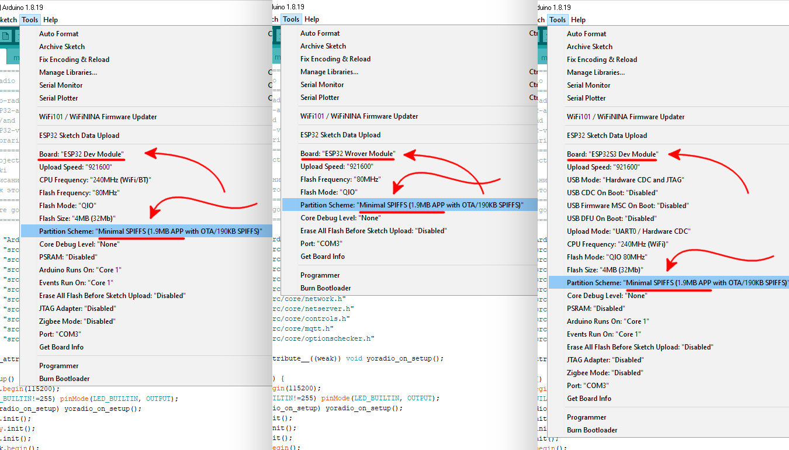
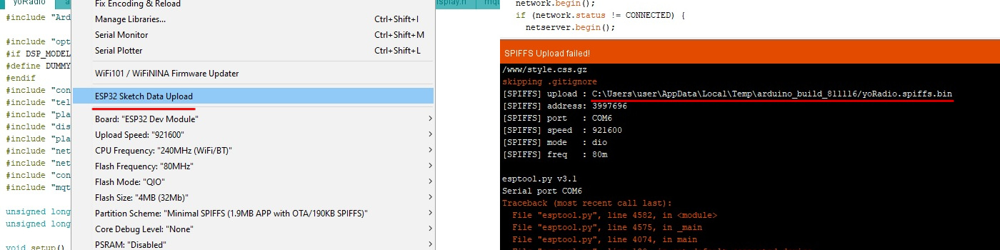
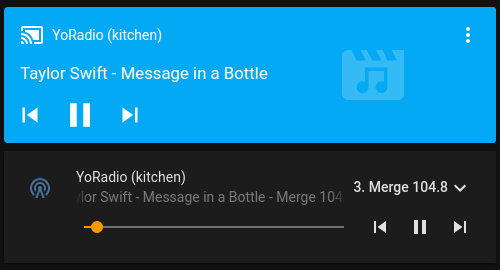

# Мод yoRadio v0.9.720 з Українською локалізацією, максимально оновленими аудіо-бібліотеками, що працює на Arduino 2.0.17.


Мод створений на основі [ёRadio](https://github.com/e2002/yoradio),

з використанням аудіо-бібліотек audioI2S [Вихідників від Wolle (schreibfaul1) 3.1.0d від 01.02.2025](https://github.com/schreibfaul1/ESP32-audioI2S/releases/tag/3.1.0),

[адаптованих Maleksm](https://4pda.to/forum/index.php?showtopic=1010378&view=findpost&p=125839228) для роботи з ядром Arduino 2.0.17

yoRadio перекладено Українською мовою.
Додана можливість компіляції в Visual Studio Code, за допомогою Platformio.
Перероблено логіку перемикання станцій на другому енкодері. Тепер при виборі станції не треба натискати на енкодер, підтвердження відбувається автоматично через три секунди.
Додано підтримку CJMCU-4344
При використанні, в myoptions.h потрібно розкоментувати #define I2S_MCLK і прописати піни, до яких підключили DAC CJMCU-1334

---
- [Hardware](#hardware)
- [Connection tables](#connection-tables)
- [Software dependencies](#dependencies)
- [Hardware setup](#hardware-setup)
- [Quick start](#quick-start)
- [Detailed start](https://github.com/e2002/yoradio/wiki/How-to-flash)
- [Update](#update)
- [Update over web-interface](#update-over-web-interface)
- [Controls](Controls.md)
- [MQTT](#mqtt)
- [Home Assistant](#home-assistant)
- [More features](#more-features)
- [Plugins](#plugins)
- [Version history](#version-history)
---
#### NEW!
##### yoRadio Printed Circuit Boards repository:
[](https://github.com/e2002/yopcb)

https://github.com/e2002/yopcb

---


##### More images in [Images.md](Images.md)

---
## Hardware
#### Required:
**ESP32 board**: https://aliexpress.com/item/32847027609.html \
**I2S DAC**, roughly like this one: https://aliexpress.com/item/1005001993192815.html \
https://aliexpress.com/item/1005002011542576.html \
or **VS1053b module** : https://aliexpress.com/item/32893187079.html \
https://aliexpress.com/item/32838958284.html \
https://aliexpress.com/item/32965676064.html

#### Optional:
##### Displays
- **ST7735** 1.8' or 1.44' https://aliexpress.com/item/1005002822797745.html
- or **SSD1306** 0.96' 128x64 I2C https://aliexpress.com/item/1005001621806398.html
- or **SSD1306** 0,91' 128x32 I2C https://aliexpress.com/item/32798439084.html
- or **Nokia5110** 84x48 SPI https://aliexpress.com/item/1005001621837569.html
- or **ST7789** 2.4' 320x240 SPI https://aliexpress.com/item/32960241206.html
- or **ST7789** 1.3' 240x240 SPI https://aliexpress.com/item/32996979276.html
- or **SH1106** 1.3' 128x64 I2C https://aliexpress.com/item/32683094040.html
- or **LCD1602** 16x2 I2C https://aliexpress.com/item/32305776560.html
- or **LCD1602** 16x2 without I2C https://aliexpress.com/item/32305776560.html
- or **SSD1327** 1.5' 128x128 I2C https://aliexpress.com/item/1005001414175498.html
- or **ILI9341** 3.2' 320x240 SPI https://aliexpress.com/item/33048191074.html
- or **ILI9341** 2.8' 320x240 SPI https://aliexpress.com/item/1005004502250619.html
- or **SSD1305 (SSD1309)** 2.4' 128x64 SPI/I2C https://aliexpress.com/item/32950307344.html
- or **SH1107** 0.96' 128x64 I2C https://aliexpress.com/item/4000551696674.html
- or **GC9106** 0.96' 160x80 SPI (looks like ST7735S, but it's not him) https://aliexpress.com/item/32947890530.html
- or **LCD2004** 20x4 I2C https://aliexpress.com/item/32783128355.html
- or **LCD2004** 20x4 without I2C https://aliexpress.com/item/32783128355.html
- or **ILI9225** 2.0' 220x176 SPI https://aliexpress.com/item/32952021835.html
- or **Nextion displays** - [more info](https://github.com/e2002/yoradio/tree/main/nextion)
- or **ST7796** 3.5' 480x320 SPI https://aliexpress.com/item/1005004632953455.html?sku_id=12000029911293172
- or **GC9A01A** 1.28' 240x240 https://aliexpress.com/item/1005004069703494.html?sku_id=12000029869654615
- or **ILI9488** 3.5' 480x320 SPI https://aliexpress.com/item/1005001999296476.html?sku_id=12000018365356570
- or **ILI9486** (Testing mode) 3.5' 480x320 SPI https://aliexpress.com/item/1005001999296476.html?sku_id=12000018365356568
- or **SSD1322** 2.8' 256x64 SPI https://aliexpress.com/item/1005003480981568.html
- or **ST7920** 2.6' 128x64 SPI https://aliexpress.com/item/32699482638.html
- or **ST7789** 2.25' 284x76 SPI https://aliexpress.ru/item/1005009016973081.html

(see [Wiki](https://github.com/e2002/yoradio/wiki/Available-display-models) for more details)

##### Controls
- Three tact buttons https://www.aliexpress.com/item/32907144687.html
- Encoder https://www.aliexpress.com/item/32873198060.html
- Joystick https://aliexpress.com/item/4000681560472.html \
https://aliexpress.com/item/4000699838567.html
- IR Control https://www.aliexpress.com/item/32562721229.html \
https://www.aliexpress.com/item/33009687492.html
- Touchscreen https://aliexpress.com/item/33048191074.html

##### RTC
- DS1307 or DS3231 https://aliexpress.com/item/4001130860369.html

---
## Connection tables
##### Use [this tool](https://e2002.github.io/docs/myoptions-generator.html) to build your own connection table and myoptions.h file.
<br />

https://e2002.github.io/docs/myoptions-generator.html

---
## Dependencies
#### Libraries:
**Library Manager**: Adafruit_GFX, Adafruit_ST7735\*, Adafruit_SSD1306\*, Adafruit_PCD8544\*, Adafruit_SH110X\*, Adafruit_SSD1327\*, Adafruit_ILI9341\*, Adafruit_SSD1305\*, TFT_22_ILI9225\* (\* depending on display model), OneButton, IRremoteESP8266, XPT2046_Touchscreen, RTCLib \
**Github**: ~~[ESPAsyncWebServer](https://github.com/me-no-dev/ESPAsyncWebServer), [AsyncTCP](https://github.com/me-no-dev/AsyncTCP), [async-mqtt-client](https://github.com/marvinroger/async-mqtt-client) (if you need MQTT support)~~ <<< **starting with version 0.8.920, these libraries have been moved into the project, and there is no need to install them additionally.**

#### Tool:
[ESP32 Filesystem Uploader](https://randomnerdtutorials.com/install-esp32-filesystem-uploader-arduino-ide/)

**See [wiki](https://github.com/e2002/yoradio/wiki/How-to-flash#preparing) for details**

---
## Hardware setup
Don't edit the options.h! \
Hardware is adjustment in the **[myoptions.h](examples/myoptions.h)** file.

**Important!**
You must choose between I2S DAC and VS1053 by disabling the second module in the settings:
````c++
// If I2S DAC used:
#define I2S_DOUT      27
#define VS1053_CS     255
// If VS1053 used:
#define I2S_DOUT      255
#define VS1053_CS     27
````
Define display model:
````c++
#define DSP_MODEL  DSP_ST7735 /*  default - DSP_DUMMY  */
````
The ST7735 display submodel:
````c++
#define DTYPE INITR_BLACKTAB // 1.8' https://aliexpress.ru/item/1005002822797745.html
//#define DTYPE INITR_144GREENTAB // 1.44' https://aliexpress.ru/item/1005002822797745.html
````
Rotation of the display:
````c++
#define TFT_ROTATE 3 // 270 degrees
````
##### Note: If INITR_BLACKTAB dsp have a noisy line on one side of the screen, then in Adafruit_ST7735.cpp:
````c++
  // Black tab, change MADCTL color filter
  if ((options == INITR_BLACKTAB) || (options == INITR_MINI160x80)) {
    uint8_t data = 0xC0;
    sendCommand(ST77XX_MADCTL, &data, 1);
    _colstart = 2; // ← add this line
    _rowstart = 1; // ← add this line
  }
````

---
## Quick start
<br />

- <span style="color: red; font-weight: bold; font-size: 22px;text-decoration: underline;">Arduino IDE version 2.x.x is not supported. Use Arduino IDE 1.8.19</span>
- <span style="color: red; font-weight: bold; font-size: 22px;text-decoration: underline;">ESP32 core version 2.0.0 or higher is [required](https://github.com/espressif/arduino-esp32)!</span>

1. Generate a myoptions.h file for your hardware configuration using [this tool](https://e2002.github.io/docs/myoptions-generator.html).
2. Put myoptions.h file next to yoRadio.ino.
3. Replace file Arduino/libraries/Adafruit_GFX_Library/glcdfont.c with file [yoRadio/fonts/glcdfont.c](yoRadio/fonts/glcdfont.c)
4. Restart Arduino IDE.
5. In ArduinoIDE - upload sketch data via Tools→ESP32 Sketch Data Upload ([it's here](images/board2.jpg))
6. Upload the sketch to the board
7. Connect to yoRadioAP access point with password 12345987, go to http://192.168.4.1/ configure and wifi connections.  \
_\*this step can be skipped if you add WiFiSSID WiFiPassword pairs to the [yoRadio/data/data/wifi.csv](yoRadio/data/data/wifi.csv) file (tab-separated values, one line per access point) before uploading the sketch data in step 1_
8. After successful connection go to http://\<yoipaddress\>/ , add stations to playlist (or import WebStations.txt from KaRadio)
9. Well done!

**See [wiki](https://github.com/e2002/yoradio/wiki/How-to-flash#build--flash) for details**

---
## Update
1. Backup your settings: \
download _http://\<yoradioip\>/data/playlist.csv_ and _http://\<yoradioip\>/data/wifi.csv_ and place them in the yoRadio/data/data/ folder
2. In ArduinoIDE - upload sketch data via Tools→ESP32 Sketch Data Upload
3. Upload the sketch to the board
4. Go to page _http://\<yoradioip\>/_ in the browser and press Ctrl+F5 to update the scripts.
5. Well done!

## Update over web-interface
1. Backup your settings: \
download _http://\<yoradioip\>/data/playlist.csv_ and _http://\<yoradioip\>/data/wifi.csv_ and place them in the yoRadio/data/data/ folder
2. Get firmware binary: Sketch → Export compiled binary
3. Get SPIFFS binary: disconnect ESP32 from your computer, click on **ESP32 Data Sketch Upload**. \
 You will get an error and file path

 

4. Go to page _http://\<yoradioip\>/update_ and upload yoRadio.ino.esp32.bin and yoRadio.spiffs.bin in turn, checking the appropriate upload options.
5. Well done!

---
## MQTT
1. Copy file examples/mqttoptions.h to yoRadio/ directory
2. In the mqttoptions.h file, change the options to the ones you need
3. Well done!

---
## Home Assistant
<br />

0. Requires [MQTT integration](https://www.home-assistant.io/integrations/mqtt/)
1. Copy directory HA/custom_components/yoradio to .homeassistant/custom_components/
2. Add yoRadio entity into .homeassistant/configuration.yaml ([see example](HA/example_configuration.yaml))
3. Restart Home Assistant
4. Add Lovelace Media Player card to UI (or [mini-media-player](https://github.com/kalkih/mini-media-player) card)
5. Well done!

---
## More features
- Can add up to 65535 stations to a playlist. Supports and imports [KaRadio](https://github.com/karawin/Ka-Radio32) playlists (WebStations.txt)
- Telnet with KaRadio format output \
  **see [list of available commands](https://github.com/e2002/yoradio/wiki/List-of-available-commands-(UART-telnet-GET-POST))**

- MQTT support \
 **Topics**: \
 **MQTT_ROOT_TOPIC/command**     - Commands \
 **MQTT_ROOT_TOPIC/status**      - Player status \
 **MQTT_ROOT_TOPIC/playlist**    - Playlist URL \
 **MQTT_ROOT_TOPIC/volume**      - Current volume \
 **Commands**: \
 **prev**          - prev station \
 **next**          - next station \
 **toggle**        - start/stop playing \
 **stop**          - stop playing \
 **start, play**   - start playing \
 **boot, reboot**  - reboot \
 **volm**          - step vol down \
 **volp**          - step vol up \
 **vol x**         - set volume \
 **play x**        - play station x

- Home Assistant support

---
## Plugins
The `Plugin` class serves as a base class for creating plugins that hook into various system events.  
To use it, inherit from `Plugin` and override the necessary virtual methods.  
Place your new class in the `src/plugins/<MyPlugin>` directory
More details can be found in the comments within the `yoRadio/src/pluginsManager/pluginsManager.h` file and at [here](https://github.com/e2002/yoradio/blob/main/yoRadio/src/pluginsManager/README.md).  
Additional examples are provided in the `examples/plugins` folder.
Work is in progress...

---
## Version history
#### v0.9.720
- PR #211 https://github.com/e2002/yoradio/pull/211
- fix packets lost in HLS-TS
- fix stuttering if datatransfer is chunked
- split processWebStream/processWebFile
- fixed the error of connecting to the next access points from the list if the first one is unavailable
- fixed playback control errors from Home Assistant
- the DEF_SPI_FREQ parameter, intended for setting the user speed SPI of displays, has been removed from the settings (they work fine anyway)
- fixed an error connecting to the MQTT server during initial boot in SDCARD mode

#### v0.9.711
- fixed compilation error for LCD displays #210

#### v0.9.710
- rewritten ILI9225 display driver: now it supports framebuffer like the others and is more stable 👍🏻
- fixed clock update bug when changing timezone in settings
- bug/warnings fixes

#### v0.9.702
- fixed compilation error for Nokia5110 displays

#### v0.9.700
- added support for **ST7789 320x170** displays \
  `#define DSP_MODEL DSP_ST7789_170`
- added support for **LCD 20x2** displays (e.g. [WH2002A](https://aliexpress.com/item/32812259852.html)) \
  `#define DSP_MODEL DSP_2002` or \
  `#define DSP_MODEL DSP_2002I2C`
- added Russian language support for LCD displays that natively support Russian \
  to enable, add `#define LCD_RUS` in **myoptions.h** \
  PS: I cannot say in advance whether your LCD display supports Russian. \
  PS2: the method of “Russification” for LCD displays without native Russian support (based on 8 custom characters) cannot be used, since 8 symbols are too few to display all the required information.
- bug fixes

#### v0.9.693
- fixed incorrect behavior of the `HIDE_VU` setting [#205](https://github.com/e2002/yoradio/issues/205)
- fixed `CORRUPT HEAP` error when playing "invalid links" [#203](https://github.com/e2002/yoradio/issues/203)
- optimized code of `utfToAscii` [utf8Rus](https://github.com/e2002/yoradio/blob/main/yoRadio/src/displays/tools/utf8Rus.cpp)

#### v0.9.689
- fixed artifacts in scrolling text

#### v0.9.686
- fixed SD card connection bug in configurations with `SD_SPIPINS` defined
- time synchronization setting

#### v0.9.682
- fixed bug with redundant epoch time being added to the tag in SD mode https://t.me/yoradiochat/66688

#### v0.9.680
- fixed clock display bug when exiting screensaver in playback mode
- increased number of SD card initialization attempts when switching mode

#### v0.9.676
- fixed bug with incorrect text clipping on scrolling widgets

#### v0.9.670
- display performance optimization
- to improve rendering smoothness, a framebuffer has been added for TFT SPI displays **ST7735, ST7789, ILI9341, GC9106, ST7796, GC9A01A, ILI9488, ILI9486** \
  the framebuffer is applied only to moving elements (scrolling text, VU meter, clock) \
  the framebuffer works on modules with additional **PSRAM** \
  on such modules, the framebuffer is enabled automatically, no extra steps required \
  to disable the framebuffer, add `#define USE_FBUFFER false` in **myoptions.h** \
  on modules without PSRAM, the framebuffer is disabled by default. It can be forced on by adding `#define SFBUFFER` in **myoptions.h** \
  but in that case, free memory (as well as HTTPS streams) will be severely limited
- fixed compilation error for Nextion displays
- code cleanup, optimization, and refactoring
- bug fixes

#### v0.9.574
- fixed compilation error for certain displays when `#define DSP_INVERT_TITLE false` is set
- fixed compilation error for `DSP_DUMMY`

#### v0.9.570
- added support for ST7789 284x76 2.25' SPI displays https://aliexpress.ru/item/1005009016973081.html \
  note: the brightness pin of this display should be pulled up to GND

#### v0.9.561
**!!! a [full update](#update-over-web-interface) with Sketch data upload is required !!!**\
  or-> just upload `yoRadio/data/www/script.js.gz` to Webboard Uploader http://radioipaddr/webboard \
  After updating please clear browser cache.
- fixed error when switching to SD Card mode
- fixed issue causing random reboots
- fixed preview playback bug in Playlist Editor

#### v0.9.555
- fixed error "assert failed: udp_new_ip_type /IDF/components/lwip/lwip/src/core/udp.c:1278 (Required to lock TCPIP core functionality!)"\
  part #2
- weather synchronization code rewritten

#### v0.9.553
- fix "No 'Access-Control-Allow-Origin' header is present on the requested resource" on saving playlist\
  just reupload the file `script.js.gz` with Webboard uploader
- fixed error "assert failed: udp_new_ip_type /IDF/components/lwip/lwip/src/core/udp.c:1278 (Required to lock TCPIP core functionality!)"
- fixed error "Exception in status_listener when handling msg" in HA component

#### v0.9.552
- fixed compilation error for ESP cores version below 3.0.0\
  Thanks to @salawalas ! https://github.com/e2002/yoradio/pull/197/
- disabled websocket reconnection on all pages except the start page "/"\
  just reupload the file `script.js.gz`

#### v0.9.550
**!!! a [full update](#update-over-web-interface) with Sketch data upload is required. After updating please press CTRL+F5 in browser !!!**\
or-> just upload all files from data/www (11 pcs) to Webboard Uploader http://radioipaddr/webboard
- fixed the issue with selecting all rows in the playlist editor
- netserver optimization – Part 2
- cleanup – Part 1
- page class migrated from LinkedList to std::list (Huge thanks to @vortigont!)
  https://github.com/vortigont/yoradio/commit/b6d7fdd973bfa7395a894ceceaef40925b3f5161#diff-5df2b3b2edb81bdf3594469c55ec7093c641d13a2555a0cea25e7f3380c7de1a
- added WebSocket connection check in the web interface
- buffer indicator added to the web interface
- display performance optimization (Big thanks to @vortigont!) https://github.com/e2002/yoradio/pull/196/
- audio buffer size setting for modules without PSRAM moved to the web interface (new value applies after reboot, optimal value is 7)
- added option in the web interface to disable the Telnet server
- added option in the web interface to enable the Watchdog that stops connect to broken streams
- settings for time and weather synchronization intervals have been added to the web interface
- bug fixes, optimization

#### v0.9.533
- fixed compilation error for esp32 core version lower than 3.0.0
- fixed error setting display brightness to 1
- fixed error setting IR tolerance value (upload a new file `options.html.gz` via WEB Board Uploader and press Ctrl+F5 on the settings page)

#### v0.9.530
- optimization of webserver/socket code in netserver.cpp, part#1
- added support for ArduinoOTA (OTA update from Arduino IDE) (disabled by default)\
  to enable you need to add to myoptions.h: `#define USE_OTA true`\
  set password: in myoptions.h `#define OTA_PASS "myotapassword12345"`
- in web interface added basic HTTP authentication capability (disabled by default)\
  to enable you need to add to myoptions.h:\
  `#define HTTP_USER "user"`\
  `#define HTTP_PASS "password"`
- added "emergency firmware uploader" form (for unforeseen cases) http://ipaddress/emergency
- added config (sys.config) telnet command that displays the same information usually shown over serial at boot.
- bug fixes 🪲

#### v0.9.515
- fixed a bug with resetting all parameters when resetting only one section of parameters

#### v0.9.512
- fixed bug with saving ntp server #1 value

#### v0.9.511
In this version, the contents of the data/www directory have changed, so that the first time you flash it, you will be greeted by WEB Board Uploader. Just upload all the files from data/www (11 pcs) to it\
or -> **!!! a [full update](#update-over-web-interface) with Sketch data upload is required. After updating please press CTRL+F5 in browser !!!**
- fixed a bug with saving smartstart mode
- fixed a bug with no restart when initially uploading files to spiffs
- fixed a bug with hanging on unavailable hosts
- fixed a bug with attempting to connect with an empty playlist
- fixed a bug with passing strings with quotes in mqtt
- fixing some other bugs
- web interface rewritten from scratch (well, almost), bugs added 👍
- added listening to links in the browser in playlistEditor
- buttons reboot (reboot) format (spiffs format) and reset (reset settings to default) have been added to the settings
- the beginnings of theming (theme.css) (just a list of global colors that can be changed, and then uploaded to theme.css via WB uploader)

#### v0.9.434
- fixed the issue with exiting Screensaver Blank Screen mode via button presses and IR commands.
- reduced the minimum frequency for tone control on I2S modules to 80Hz.
- increased the display update task delay to 10 TICKS.
  to revert to the previous setting, add `#define DSP_TASK_DELAY 2` to `myoptions.h`.
- when ENCODER2 is connected, the UP and DOWN buttons now work as PREV and NEXT (single click).
- implemented backlight off in Screensaver Blank Screen mode.
